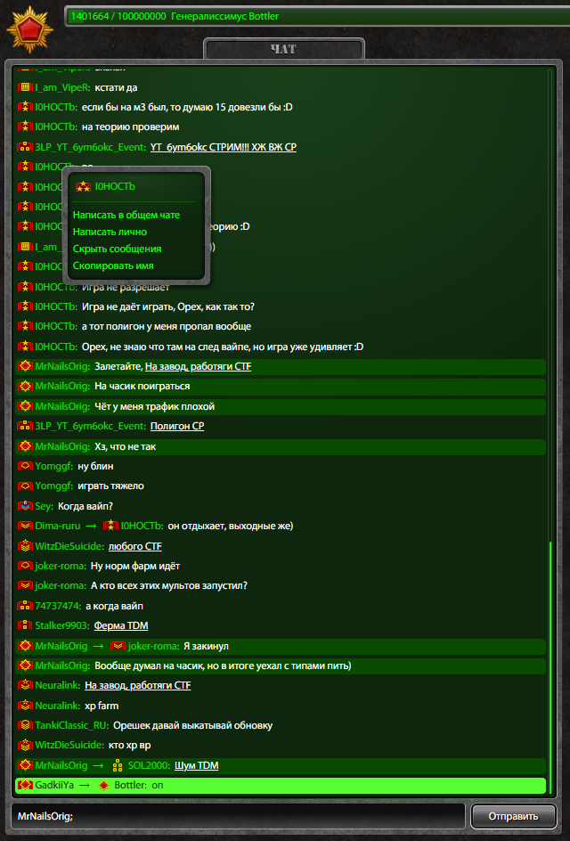
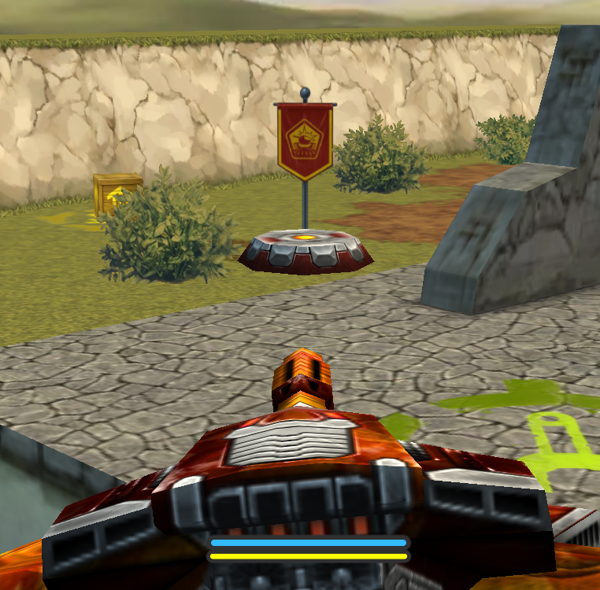
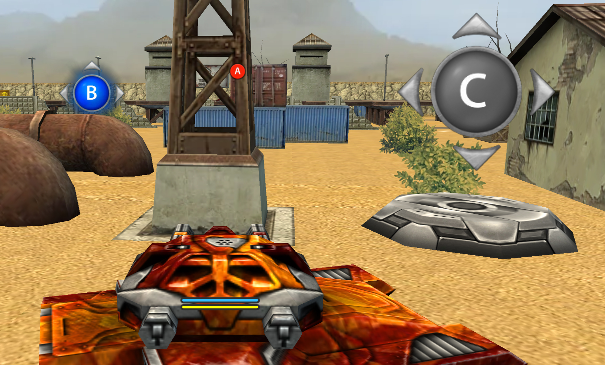

# 🛠️ Real Classic — Мод для Tanki Classic

> **Версия:** 0.7.1 
> **Платформа:** Браузер Chrome

## Уведомления о новых версиях в Telegram: https://t.me/tanki_classic_real

## Поддержать: https://web.tribute.tg/d/HyV

---

## 🚀 Установка

1.  Откройте страницу расширений браузера: `chrome://extensions/`
2.  Включите режим разработчика в правом верхнем углу.
3.  Нажмите кнопку **«Загрузить распакованное расширение»**.
4.  Выберите папку с файлами мода (должен быть файл `manifest.json`).

---

## 📷 Скриншоты

---

## 📋 Changelog

### v0.7.1

- Добавлена старая графика (пока только на карте Пинг-Понг Лето)
- Добавил стандартную ночь, а предыдущую переместил в Ночь 2012

### v0.7

- Добавлено освещение на флаги и точки
- Поправлено освещение под все эффекты и все модификации пушек
- Добавлено разное время дня на карте (в настройках)
- Добавлена отдельная вкладка настроек по моду с выбором времени на карте (День, Вечер, Ночь, Тьма)

### v0.6.3

- Мод перенесен на новую версию классики с боевым чатом
- Убрана лишняя тень от флага
- Небольшие фиксы по килфиду и изменению цвета полоски хп

### v0.6.2

- Изменен визуал полоски хп и перезарядки под флешовский
- Теперь текстуры и модели в командных режимах соответствуют цветам команд
- Заменены званки возле ника в битве на старые флешовские

### v0.6.1

- Добавлен старый килфид

UPD:
- Исправлен вывод вступил/покинул бой в килфиде
- Исправлено обновление таблицы очков в битве
- Исправлена работа чата в лобби после выхода из битвы

### v0.5

- Переработано создание битв
- Поправлена полоса ранглимита
- Теперь с первого раза применяются настройки битвы
- До этого был всегда автомасштаб, сейчас масштабирование вернул, но интерфейс подстраивается более адекватно, даже на 25% или 500% масштаба
- Небольшие фиксы чата
- Изменения по размеру и жирности шрифта в интерфейсе

### v0.4

- Добавлены старые эффекты на все пушки
- Дополнены эффекты на скины XT, PR, и разные эффекты по скинам на Гаусс, Страйкер, Молот, Вулкан
- На Изиде теперь эффект молнии, на Жиге изменена механика цвета пламени под старый эффект
- На Шафте возвращена старая картинка прицела
- На Рельсе Легаси чуть длиннее остается луч, как на старой графике
- На скин Смоки ХТ поставлена старая версия (потом в настройках можно будет включать/выключать это)

### v0.3

Обновлен контроль точек - возвращены все старые модели и иконки

### v0.2.3

Обновлены все звуковые эффекты на старые
Новые лишние звуковые эффекты удалены, в том числе и Джагернаут режим, кроме звуков движения Джагернаута

UPD: Убраны лаги гаража
- Модели контроля точек изменены частично

UPD-2: Убрано большое увеличение памяти из-за рендера флагов, когда память доходила до ограничения и сбрасывалась, создавая фризы

UPD-3: Исправлена позиция флага относительно камеры

### v0.1 (Первый релиз)

| Функция | Статус | Описание |
|---------|--------|----------|
| 😎 Чат | ✅ Готово | Интерфейс заменён на старый стиль |
| 🔄 Перезарядка | ✅ Готово | Добавлена иконка перезарядки |
| 🏳️ Флаг | ✅ Готово | Модели заменены на старые |
| ☁️ Подсветка | ✅ Готово | Отключена подсветка танка |
| 🚫 HUD CTF | ✅ Готово | Убраны лишние иконки |
| 📄 Фонд новый HUD | ✅ Готово | Убрана плашка фонда |

  

