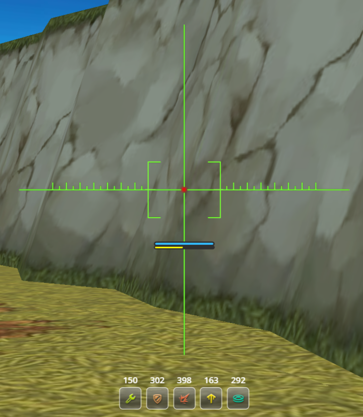

# 🛠️ Real Classic — Мод для Tanki Classic

> **Версия:** 0.1  
> **Платформа:** Браузер Chrome

---

## 📷 Скриншоты

  
  

---

## ✨ Особенности

Модификация настраивает игровой клиент под визуальные стандарты старых версий игры:

- 🔫 **Старые модели флага**: Возвращены 3D-модели флагов из режима CTF (Capture The Flag).
- ⏳ **Иконка перезарядки**: Добавлена кнопка перезарядки в интерфейсе боя.
- 💬 **Флеш-чат**: Интерфейс чата стилизован под старый Flash-клиент.
- ❌ **Убрана подсветка танка**: Удалена лишняя подсветка вашего танка на карте.
- 🗑️ **Очищен новый HUD**: Убраны лишние элементы нового интерфейса:
  - Иконки командного режима CTF.
  - Плашки из верхнего меню.
- 🎨 **Чат как прежде**: Изменен дизайн чата под классический стиль.

---

## 📋 Changelog

### v0.1 (Первый релиз)

| Функция | Статус | Описание |
|---------|--------|----------|
| 😎 Чат | ✅ Готово | Интерфейс заменён на старый стиль |
| 🔄 Перезарядка | ✅ Готово | Добавлена иконка перезарядки |
| 🏳️ Флаг | ✅ Готово | Модели заменены на старые |
| ☁️ Подсветка | ✅ Готово | Отключена подсветка танка |
| 🚫 HUD CTF | ✅ Готово | Убраны лишние иконки |
| 📄 Фонд новый HUD | ✅ Готово | Убрана плашка фонда |

---

## 🚀 Установка

1.  Откройте страницу расширений браузера: `chrome://extensions/`
2.  Включите режим разработчика в правом верхнем углу.
3.  Нажмите кнопку **«Загрузить распакованное расширение»**.
4.  Выберите папку с файлами мода (должен быть файл `manifest.json`).
